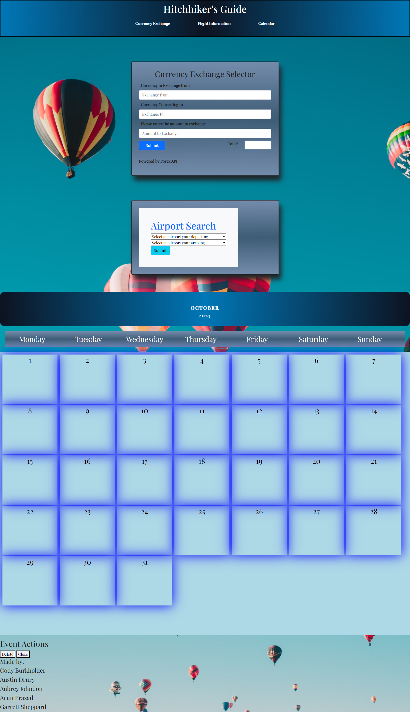

## Travel-Application

## Description:
The Hitchhiker's Guide is a project that was a collaborative effort to build an application that would be a suitable travel companion when on the road. The goal was to take advantage of flight information and currency conversion API's to provide meaningful information to travellers.  The application is meant to be a hub for useful information such as airline and airport flight status, and currency exchange rates. Utilizing two different APIs, this application is also able to save your important memos or reminders into an interactive calendar feature as well.

## Technologies Used:
-[Free Forex API](https://freeforexapi.com/) 
-[AviationStack API](https://aviationstack.com/documentation) 

## Deployed Application:
[Hitchhiker's Guide](https://chilejay7.github.io/Hitchhiker-s-Guide-Travel-App-/)

## -- User Story --
As a user, I want to have a lot of relevant information or tools regarding my trip in one application.
As a user, I want to be able to see information about my airport: delays, weather, and useful info for my departure / arrival.

As a user, I want to be able to see current prices and conversion rates for multiple currencies.

As a user, I want to be able input data into a calendar, and be able to leave the page without losing the data.

## -- Acceptance Criteria --
It is DONE when I load the page, and I'm presented with an interactive calendar.

It is DONE when I load the page, and I'm presented with a navigation menu that gives me accessiblity to different features of the application.

It is DONE when I can click on a tab regarding aviation, that opens a new page displaying relevant information regarding airports, airlines, weather alerts, or potential delays.

It is DONE when I can click on a tab regarding currency, that opens a new page displaying a section able to convert sums of one currency into another, allowing me to see the conversion rates in real time.

It is DONE when I can input data that gets saved to LocalStorage via the application's calendar, and it is there the next time I visit the application.

## Usage:

A screenshot of the application has been included below for reference.  There are three main parts that combine to create the Hitchhiker's Guide: the flight search form, the currency converter, and the calendar.  Each section is linked in the navigation menu within the header.  Clicking on the link will take the user to the corresponding section.  In the Airport search from, airports can be selected using the dropdown menus.  The AviationStack API is used to pull flight information based on the departing airport, the first selector in the Airport Search form.  The second selector represents the destination airport and, together with the first selection made, provides flight information between the two locations.  The data provided by the AviationAPI server is then saved to the calendar.

The Currency Exchange form provides three input fields.  The first is the currency the user would like to exchange from, the second is the currency it will be converted to, and the third is the amount to be exchanged.  The from and to fields use an autocomplete function with currency abbreviations stored in an array to make the application easier to use.  A submit event listener captures the input values from the form to provide a conversion using data from the Forex API.  The amount is rounded to two decimal places to provide a standard currency value.  The form does not clear the input fields after the conversion in order to allow the user to enter different amounts if needed without losing the previuos currency selections.

The calendar provides a location where data related to the flight information selected can be displayed.  Data returned by the Aviation API 

## Sources:
https://www.geeksforgeeks.org/how-to-get-the-number-of-days-in-a-specified-month-using-javascript/

## License:
MIT License

Copyright (c) 2023
Cody Burkholder
Aubrey Johnson
Arun Prasad
Garrett Sheppard
Austin Drury

Permission is hereby granted, free of charge, to any person obtaining a copy of this software and associated documentation files (the "Software"), to deal in the Software without restriction, including without limitation the rights to use, copy, modify, merge, publish, distribute, sublicense, and/or sell copies of the Software, and to permit persons to whom the Software is furnished to do so, subject to the following conditions:

The above copyright notice and this permission notice shall be included in all copies or substantial portions of the Software.

THE SOFTWARE IS PROVIDED "AS IS", WITHOUT WARRANTY OF ANY KIND, EXPRESS OR IMPLIED, INCLUDING BUT NOT LIMITED TO THE WARRANTIES OF MERCHANTABILITY, FITNESS FOR A PARTICULAR PURPOSE AND NONINFRINGEMENT. IN NO EVENT SHALL THE AUTHORS OR COPYRIGHT HOLDERS BE LIABLE FOR ANY CLAIM, DAMAGES OR OTHER LIABILITY, WHETHER IN AN ACTION OF CONTRACT, TORT OR OTHERWISE, ARISING FROM, OUT OF OR IN CONNECTION WITH THE SOFTWARE OR THE USE OR OTHER DEALINGS IN THE SOFTWARE.